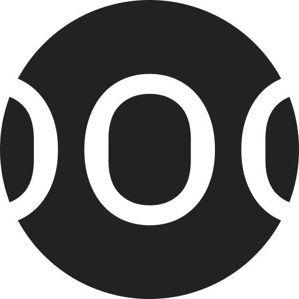

<div align="center">
  
</div>

# SOOG - Speculative Organology Organogram Generator


[](https://github.com/huggingface/transformers)
[](https://github.com/pytorch/pytorch)
[](https://github.com/numpy/numpy)
[](https://github.com/matplotlib/matplotlib)
[](https://github.com/pallets/flask)
[](https://github.com/psf/requests)
[](https://github.com/openai/openai-python)
[](https://github.com/tqdm/tqdm)
[](https://github.com/NVIDIA/nccl)
[](https://github.com/huggingface/huggingface_hub)

SOOG is an innovative web application that helps visualize and create musical instruments using the organogram technique, originally developed by ethnomusicologist Mantle Hood. The application extends this methodology to enable speculative instrument design through geometric and acoustic manipulation.

## Core Features

1. **Visualization System**

   - Abstract instrument representation using geometric shapes
   - Color-coded material identification
   - Movement and interaction indication through arrows
   - Acoustic space visualization
   - Measurable component representation

2. **Instrument Classification**

   - Idiophones: squares
   - Membranophones: horizontal rectangles
   - Chordophones: vertical rectangles
   - Aerophones: circles
   - Electronophones: rhombus

3. **Material Color Coding**
   - Wood: orange
   - Bamboo: yellow
   - Skin: pink
   - Glass: green
   - Stone: white
   - Water: blue
   - And more...

## Technical Implementation

### Frontend Stack

1. **Core Technologies**

   - Nuxt 3: Vue-based framework for server-side rendering
   - Vite: Next-generation frontend tooling
   - Bun: Fast JavaScript runtime and package manager
   - TypeScript: Type-safe development

2. **UI Components**
   - Vue.js 3 with Composition API
   - Three.js for 3D visualization
   - D3.js/Plotly for vector graphics
   - WebGL for advanced rendering

### Backend Architecture

1. **AI and ML Integration**

   - GPT-4 API for natural language processing
   - Custom BERT models fine-tuned for:
     - Instrument classification
     - Material recognition
     - Acoustic property prediction
   - Multi-modal model combining text and image analysis

2. **Redis Caching System**

   - GPT Response Caching (1 hour TTL)
   - Plot Image Caching (30 minutes TTL)
   - Model Caching (24 hours TTL)
   - Static Content Caching (12 hours TTL)

3. **Cache Components**
   - `cache_config.py`: Redis settings and TTLs
   - `cache_manager.py`: Redis operations
   - `cache_decorators.py`: Caching decorators

### Model Training

1. **BERT-based Models**

   - Base model: DistilBERT
   - Training data:
     - Academic papers on organology
     - Instrument specifications
     - Material properties
   - Fine-tuning objectives:
     - Text classification
     - Feature extraction
     - Relationship mapping

2. **Multi-modal Integration**
   - CLIP for image-text alignment
   - Custom attention mechanisms
   - Cross-modal feature fusion

## Roadmap

### Current Implementation

- Basic organogram generation
- Material and shape visualization
- Acoustic space representation
- Interactive UI with keyboard shortcuts

### Planned Features

1. **Query Parser Enhancement**

   - Natural language processing for input classification
   - Keyword-based modality mapping:
     - Text responses
     - Vector visualization (matplotlib, d3, plotly)
     - 3D space (three.js)

2. **Advanced Training Systems**

   - Skill-Based Model Training:
     - Natural language generation
     - Code generation for visualizations
     - Logic-based reasoning
   - Dynamic Prompt Engineering:
     - Context-aware prompt generation
     - Specialized expertise activation

3. **Input Parsing Categories**
   - Draw: Vector-based visualization
   - Simulate: 3D space representation
   - Explain: Text-based response

### Future Development

1. **Extended Organological Features**

   - Acoustic simulation integration
   - Material physics modeling
   - Interactive sound generation
   - Real-time collaboration tools

2. **AI Enhancement**

   - Improved instrument recognition
   - Advanced morphological analysis
   - Historical instrument database integration
   - Cross-cultural instrument mapping

3. **Research Tools**
   - Academic citation integration
   - Research paper generation
   - Comparative analysis tools
   - Dataset visualization

## Setup Requirements

1. Install Redis Server:

```bash
# macOS
brew install redis
brew services start redis

# Ubuntu
sudo apt-get install redis-server
sudo systemctl start redis-server
```

2. Install Dependencies:

```bash
# Install Bun
curl -fsSL https://bun.sh/install | bash

# Install project dependencies
bun install        # Frontend
pip install -r requirements.txt  # Backend
```

## Academic Context

SOOG is part of a doctoral research project in Music Performance Research at the Hochschule der Künste Bern, extending Hood's organogram methodology into the domain of speculative organology.

## References

Hood, Mantle (1982). _The ethnomusicologist_ (2nd ed.). Kent State University Press.
